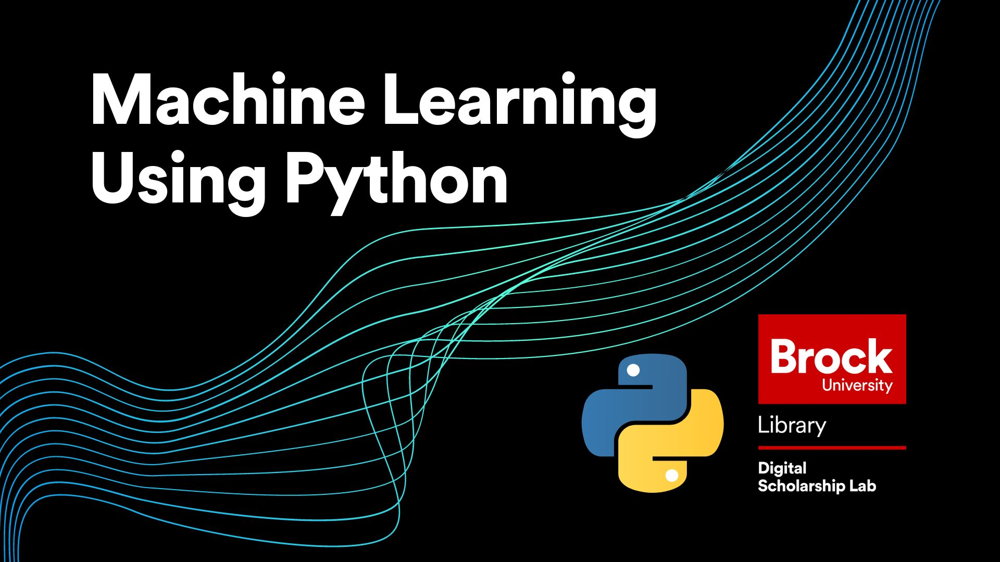

# Introduction to Machine Learning with Python

We'll do all of the work for today's tutorial using Juypter Notebooks and Google Colab.
You'll need a Google Account to launch the interactive interface.

## Prerequistes

This tutorial assumes some knowledge of Python. To get ready for this session you can complete the following:

[Introduction to Python](https://brockdsl.github.io/Intro_to_Python_Workshop/) - An introduction to the langauage that starts from scratch

[Python 2.0](https://brockdsl.github.io/Python_2.0_Workshop/) - A more advanced look into Python that focuses on how to analyze data using the language

**OPTIONAL**

[Case Study: Sci Hub Usage](https://brockdsl.github.io/SciHub_Workshop/) - A case study workshop that uses Python tools to analyze usage patterns of the (in)famous platform [SciHub](https://en.wikipedia.org/wiki/Sci-Hub)

## Handout

A handout with a description of what is covered in the session can be found  [here](https://brockdsl.github.io/Machine_Learning_with_Python/pythonmachine.pdf)

## Getting Started

We will be using the Google Collab platform for today's workshop. 

 Intro to Machine Learning

